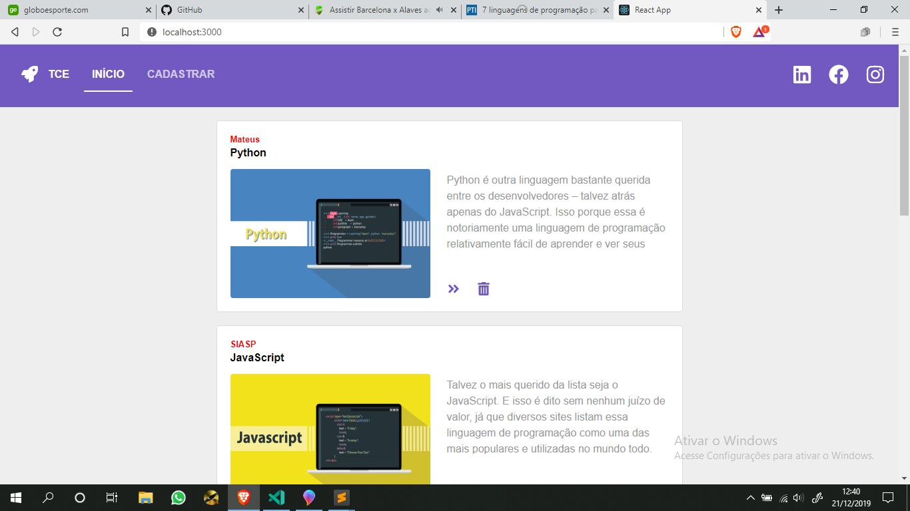

# Treinamento - NodeJS e ReactJS

**PS:**  Treinamento Ministrado Na Universidade Federal Rural do Semi Árido em 6 Encontros no Intuito de Apresentar o NodeJs e ReactJs Como Uma Ótima Opção Para o Desenvolvimento Web. (Frontend - Backend)

## Sobre Este Treinamento  📌

  A Idéia do Treinamento é:
  "Aplicar em uma solução real as operações Básicas da Programação (CRUD), Criando um Formulario para Cadastrar uma notícia, Listando todas as noticas, Excluindo e Exibindo com mais detalhes uma noticia específica ."

## Why?

Este projeto faz parte do meu portfólio pessoal, portanto, ficarei feliz se você puder me fornecer algum feedback sobre a didática, nivel de ensino, projeto, código, estrutura ou qualquer coisa que você possa relatar que possa me tornar um desenvolvedor melhor e mais didático! 

Email-me: mateustech686@gmail.com

Conecte-se comigo em [LinkedIn]([https://www.linkedin.com/in/mateus-fernandes-costa-0955b1196/](https://www.linkedin.com/in/mateus-fernandes-costa-0955b1196/)).

## Backend 

 
 NodeJS - ExpressJS - Axios - Cors - Mongoose - Nodemon 

## FrontEnd

Consumindo API construida com Axios e a criando Interface com a biblioteca React!

## Instalando

1. Clone o Repositorio. (git clone "url")
2. Nas pastas "backend_treino e frontend" rode o campando "npm install" para instalar as depedencias.
3. No arquivo "TreinoUfersaNodeReact/backend_treino/src/Config/geral.js" troque a url de conexão para a sua url do mongooDB.
4. Abra o terminal na pasta Backend e rode "yarn dev"
5. Abra o terminal na pasta Frontend e rode "yarn start"

## A aplicação vai ficar assim !

# Bons Estudos!
